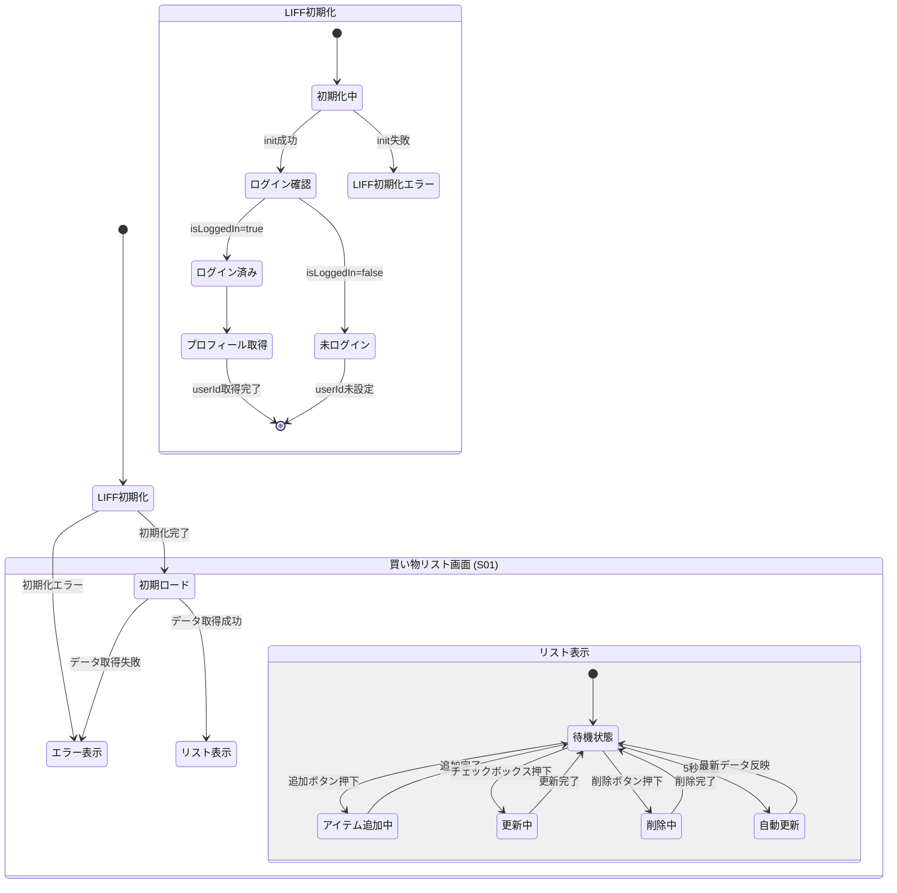

# 画面遷移図

本アプリケーションはシングルページアプリケーション (SPA) であり、ページ遷移はありませんが、LIFF初期化と状態によって表示内容が変化します。

## 状態説明

| 状態 | 説明 |
| :---: | :--- |
| LIFF初期化 | LIFF SDKの初期化を行い、LINEログイン状態を確認する |
| 初期化中 | `liff.init()` を実行中 |
| ログイン確認 | LINEログイン状態を確認 (`liff.isLoggedIn()`) |
| ログイン済み | LINEにログイン済み。プロフィール情報を取得可能 |
| 未ログイン | LINEに未ログイン。LINE User ID なしでAPIリクエストを送信 |
| プロフィール取得 | `liff.getProfile()` でユーザー情報を取得 |
| LIFF初期化エラー | LIFF初期化に失敗。エラーメッセージを表示 |
| 初期ロード | サーバーからリストデータを取得 |
| リスト表示 | 買い物リストを表示し、ユーザー操作を受け付ける |
| 待機状態 | ユーザーの操作を待機 |
| アイテム追加中 | 新しいアイテムをサーバーに送信中 |
| 更新中 | アイテムの完了状態をサーバーに送信中 |
| 削除中 | アイテムの削除リクエストをサーバーに送信中 |
| 自動更新 | 5秒ごとのポーリングでサーバーから最新データを取得 |
| エラー表示 | エラーメッセージを表示 |
