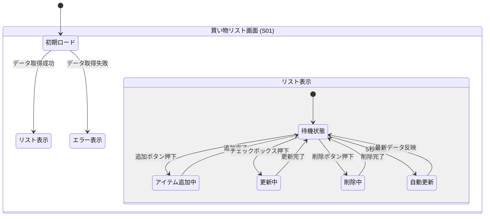

# 画面遷移図

本アプリケーションはシングルページアプリケーション (SPA) であり、ページ遷移はありませんが、状態によって表示内容が変化します。

```mermaid
stateDiagram-v2
    [*] --> 初期ロード

    state "買い物リスト画面 (S01)" as MainScreen {
        初期ロード --> リスト表示: データ取得成功
        初期ロード --> エラー表示: データ取得失敗

        state "リスト表示" as List {
            [*] --> 待機状態
            待機状態 --> アイテム追加中: 追加ボタン押下
            アイテム追加中 --> 待機状態: 追加完了
            
            待機状態 --> 更新中: チェックボックス押下
            更新中 --> 待機状態: 更新完了

            待機状態 --> 削除中: 削除ボタン押下
            削除中 --> 待機状態: 削除完了

            待機状態 --> 自動更新: 5秒経過
            自動更新 --> 待機状態: 最新データ反映
        }
    }
```
