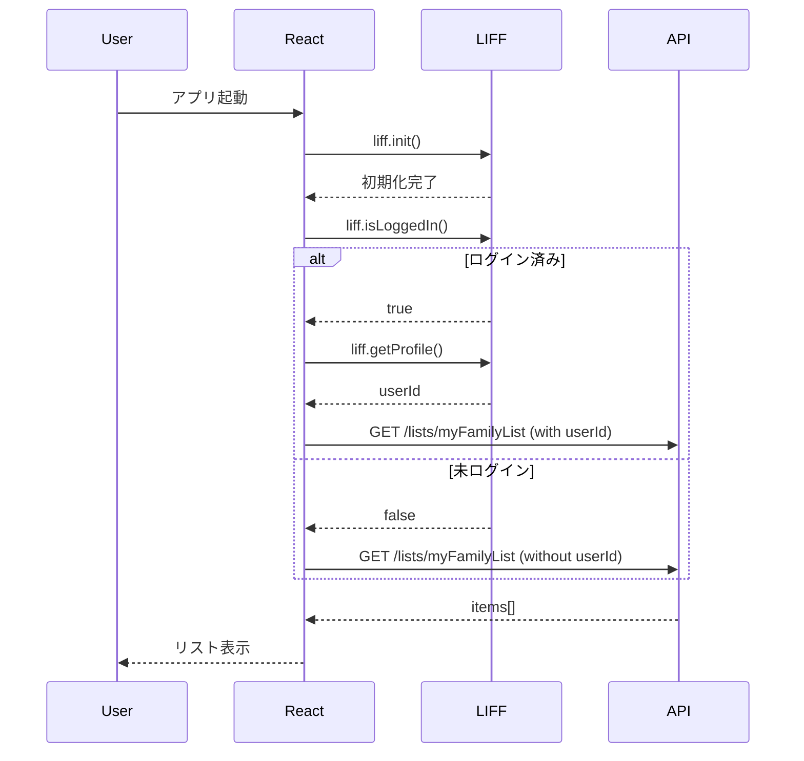
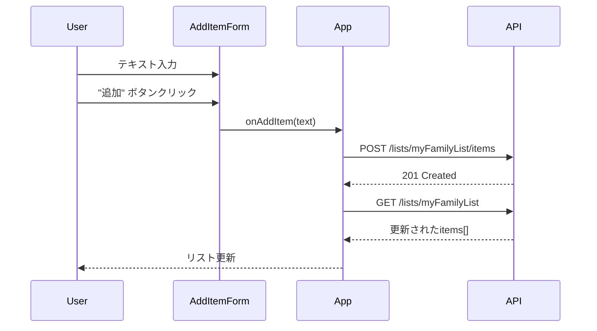
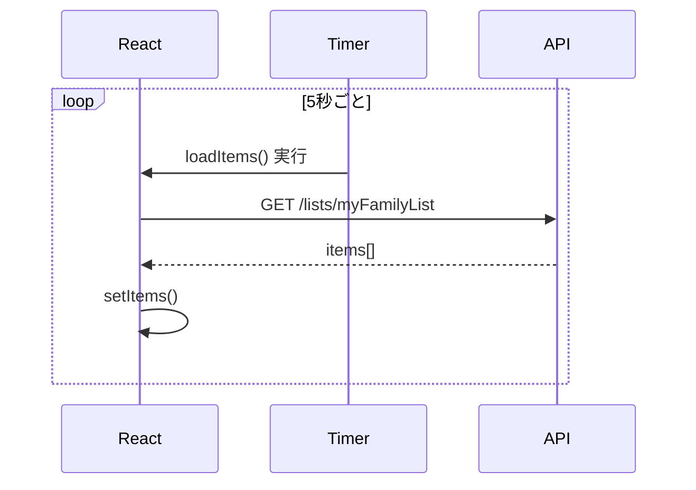

# フロントエンドアーキテクチャ設計書

買い物リストアプリケーションのフロントエンドアーキテクチャの設計思想と実装詳細を説明します。

## 📚 目次
- [概要](#概要)
- [技術選定理由](#技術選定理由)
- [アーキテクチャパターン](#アーキテクチャパターン)
- [ディレクトリ構造](#ディレクトリ構造)
- [状態管理戦略](#状態管理戦略)
- [データフロー](#データフロー)
- [LIFF連携アーキテクチャ](#liff連携アーキテクチャ)
- [スタイリング戦略](#スタイリング戦略)
- [ビルドとデプロイ](#ビルドとデプロイ)
- [パフォーマンス最適化](#パフォーマンス最適化)
- [セキュリティ考慮事項](#セキュリティ考慮事項)
- [今後の拡張性](#今後の拡張性)

## 概要

本アプリケーションは**シングルページアプリケーション (SPA)** として設計されており、以下の特徴を持ちます：

- **リアルタイム同期**: 5秒ごとのポーリングによるデータ更新
- **LINE連携**: LIFF SDKを使用した認証と識別
- **レスポンシブデザイン**: モバイルファーストのUI設計
- **サーバーレスバックエンド**: AWS API Gateway + Lambda連携

### アーキテクチャ図

```
┌─────────────────────────────────────────────────────┐
│              LINE Platform                          │
│  ┌───────────────────────────────────────────────┐  │
│  │         LIFF Application                      │  │
│  │  ┌─────────────────────────────────────────┐  │  │
│  │  │   React SPA (買い物リスト)              │  │  │
│  │  │                                         │  │  │
│  │  │   ┌─────────────────────────────────┐   │  │  │
│  │  │   │  App.tsx (Root)                 │   │  │  │
│  │  │   │  - LIFF初期化                    │   │  │  │
│  │  │   │  - 状態管理 (useState)          │   │  │  │
│  │  │   │  - API連携                      │   │  │  │
│  │  │   └─────────────────────────────────┘   │  │  │
│  │  │                │                         │  │  │
│  │  │    ┌───────────┴───────────┐             │  │  │
│  │  │    │                       │             │  │  │
│  │  │    ▼                       ▼             │  │  │
│  │  │ AddItemForm         ShoppingList         │  │  │
│  │  │                           │              │  │  │
│  │  │                           ▼              │  │  │
│  │  │                    ShoppingListItem      │  │  │
│  │  └─────────────────────────────────────────┘  │  │
│  └───────────────────────────────────────────────┘  │
└─────────────────────────────────────────────────────┘
                        │
                        │ HTTPS (Fetch API)
                        │ Headers: X-Line-User-Id
                        ▼
┌─────────────────────────────────────────────────────┐
│          AWS Cloud (Backend)                        │
│  ┌──────────────────────────────────────────────┐   │
│  │  API Gateway                                 │   │
│  │  /lists/{listId}                             │   │
│  │  /lists/{listId}/items                       │   │
│  │  /lists/{listId}/items/{itemId}              │   │
│  └──────────────────────────────────────────────┘   │
│                        │                            │
│                        ▼                            │
│  ┌──────────────────────────────────────────────┐   │
│  │  Lambda Functions                            │   │
│  └──────────────────────────────────────────────┘   │
│                        │                            │
│                        ▼                            │
│  ┌──────────────────────────────────────────────┐   │
│  │  DynamoDB                                    │   │
│  └──────────────────────────────────────────────┘   │
└─────────────────────────────────────────────────────┘
```

## 技術選定理由

### React 19.2.0
- **選定理由**:
  - 最新のReact機能（Server Components対応準備）
  - コンポーネントベースの開発による再利用性
  - 豊富なエコシステムとコミュニティ
  - LIFFとの相性が良い

### TypeScript 5.6.3
- **選定理由**:
  - 型安全性による開発時のエラー検出
  - IDEの補完機能向上
  - リファクタリングの安全性
  - APIレスポンスの型定義

### Vite 7.2.2
- **選定理由**:
  - 高速な開発サーバー起動（ESビルド）
  - ホットモジュールリプレースメント (HMR)
  - 最適化されたプロダクションビルド
  - シンプルな設定

### Tailwind CSS 4.1.17
- **選定理由**:
  - ユーティリティファーストによる迅速な開発
  - カスタムCSSの削減
  - レスポンシブデザインの容易さ
  - プロダクションビルドでの未使用CSSの除去

### @line/liff 2.27.3
- **選定理由**:
  - LINE認証の統合
  - LINEユーザー情報の取得
  - LINE Mini Appとしての機能

## アーキテクチャパターン

### コンポーネントベースアーキテクチャ
React のコンポーネントモデルを採用し、UIを再利用可能なパーツに分割しています。

```
Presentational Components (表示)
  - AddItemForm
  - ShoppingList
  - ShoppingListItem

Container Component (ロジック)
  - App (状態管理 + API連携)
```

### 単方向データフロー
Reactの原則に従い、データは親から子へ一方向に流れます。

```
Data Flow:
  App (State) → Props → Child Components
  Child Components → Callbacks → App (State Update)
```

### コロケーション原則
関連するコードを近くに配置し、変更の影響範囲を局所化しています。

## ディレクトリ構造

```
frontend/
├── src/
│   ├── App.tsx              # ルートコンポーネント（Container）
│   ├── main.tsx             # エントリーポイント
│   ├── types.ts             # 型定義（共通）
│   │
│   ├── AddItemForm.tsx      # プレゼンテーショナルコンポーネント
│   ├── ShoppingList.tsx     # プレゼンテーショナルコンポーネント
│   ├── ShoppingListItem.tsx # プレゼンテーショナルコンポーネント
│   │
│   ├── index.css            # グローバルスタイル
│   └── vite-env.d.ts        # Vite型定義
│
├── index.html               # HTMLテンプレート
├── vite.config.ts           # ビルド設定
├── package.json             # 依存関係
└── .env.example             # 環境変数テンプレート
```

### 拡張時のディレクトリ構造案

今後の機能追加を見据えた構造：

```
src/
├── components/          # UIコンポーネント
│   ├── AddItemForm/
│   ├── ShoppingList/
│   └── ShoppingListItem/
├── hooks/               # カスタムフック
│   ├── useLiff.ts
│   ├── useItems.ts
│   └── usePolling.ts
├── services/            # API通信
│   └── api.ts
├── types/               # 型定義
│   └── index.ts
├── utils/               # ユーティリティ関数
│   └── helpers.ts
└── App.tsx
```

## 状態管理戦略

### React Hooks（useState）
現在の実装では、Reactの組み込みフックのみを使用しています。

```typescript
// App.tsx
const [items, setItems] = useState<Item[]>([]);
const [lineUserId, setLineUserId] = useState<string>('');
const [liffError, setLiffError] = useState<string>('');
```

**理由**:
- アプリケーションの規模が小さい
- 状態が単一コンポーネントに集中
- 複雑な状態遷移がない

### 状態のスコープ

| 状態 | スコープ | 理由 |
|------|---------|------|
| `items` | App | 複数コンポーネントで共有 |
| `lineUserId` | App | API通信で使用 |
| `liffError` | App | グローバルエラー表示 |
| `text` (AddItemForm) | Local | フォーム内のみで使用 |

### 将来の状態管理ライブラリ導入検討

**導入タイミング**:
- 複数ページの追加
- 深いコンポーネントツリー
- グローバル状態の増加

**候補**:
- **Context API**: Reactの標準機能
- **Zustand**: 軽量でシンプル
- **Redux Toolkit**: 大規模アプリ向け

## データフロー

### 初期化フロー



### アイテム追加フロー



### ポーリングフロー



## LIFF連携アーキテクチャ

### LIFF初期化戦略

```typescript
// App.tsx
useEffect(() => {
  const initLiff = async () => {
    try {
      const liffId = import.meta.env.VITE_LIFF_ID || 'YOUR_LIFF_ID';
      await liff.init({ liffId });

      if (liff.isLoggedIn()) {
        const profile = await liff.getProfile();
        setLineUserId(profile.userId);
      }
    } catch (error) {
      setLiffError('LIFF Init Failed');
    }
  };
  initLiff();
}, []);
```

### ユーザー識別フロー

```
1. LIFF初期化
   ↓
2. ログイン状態確認 (liff.isLoggedIn())
   ↓
3-a. ログイン済み → プロフィール取得 (liff.getProfile())
   ↓
4-a. LINE User IDを保存 → API通信に使用
   
3-b. 未ログイン → User IDなし
   ↓
4-b. 匿名アクセス（任意実装）
```

### セキュリティ考慮

- **クライアント側での認証**: LIFF SDKが担当
- **API側での検証**: `X-Line-User-Id` ヘッダーはログ用（認証には使用しない想定）
- **HTTPS通信**: すべてのAPI通信は暗号化

## スタイリング戦略

### Tailwind CSS設定

```typescript
// vite.config.ts
import tailwindcss from '@tailwindcss/vite'

export default defineConfig({
  plugins: [
    react(),
    tailwindcss(),
  ],
})
```

```css
/* index.css */
@import "tailwindcss";
```

### デザインシステム

#### カラーパレット
- **プライマリ**: `indigo` (ボタン、アクセント)
- **テキスト**: `slate` (可読性重視)
- **背景**: `blue-50` to `indigo-100` (グラデーション)
- **エラー**: `red` (エラーメッセージ)

#### タイポグラフィ
- **見出し**: `text-3xl font-extrabold`
- **本文**: `text-lg font-medium`
- **プレースホルダー**: `text-sm text-slate-400`

#### スペーシング
- **コンポーネント間**: `space-y-8`
- **リストアイテム**: `space-y-3`
- **パディング**: `px-4 py-3`

#### レスポンシブブレークポイント
- `sm`: 640px
- `md`: 768px
- `lg`: 1024px

### コンポーネントスタイリング例

```tsx
// ShoppingListItem.tsx
<li className={`
  group flex items-center justify-between p-4 mb-3 
  bg-white rounded-xl border transition-all duration-200 
  ${item.done 
    ? 'border-slate-100 bg-slate-50' 
    : 'border-slate-200 shadow-sm hover:shadow-md hover:border-indigo-200'
  }
`}>
```

**ポイント**:
- 条件付きスタイル（完了状態による切り替え）
- トランジション効果（`transition-all duration-200`）
- ホバー効果（`group-hover`）

## ビルドとデプロイ

### ビルドプロセス

```bash
npm run build
```

**実行内容**:
1. `tsc`: TypeScriptの型チェック
2. `vite build`: 最適化ビルド
   - コード分割 (Code Splitting)
   - Tree Shaking (未使用コードの削除)
   - ミニファイ (圧縮)
   - アセット最適化

**出力**:
```
dist/
├── index.html
├── assets/
│   ├── index-[hash].js
│   ├── index-[hash].css
│   └── [other-assets]
```

### デプロイフロー

```
1. ローカル開発
   ↓
2. npm run build (frontend/)
   ↓
3. ビルド成果物 (dist/) 生成
   ↓
4. CDK デプロイ (プロジェクトルート)
   ↓
5. S3 + CloudFront へアップロード
```

### 環境変数の管理

```env
# .env (開発環境)
VITE_LIFF_ID=1234567890-abcdefgh

# .env.production (本番環境)
VITE_LIFF_ID=9876543210-xyzwvuts
```

**注意点**:
- `.env` ファイルは `.gitignore` に追加
- 環境ごとに異なるLIFF IDを使用
- ビルド時に埋め込まれる（動的変更不可）

## パフォーマンス最適化

### 現在の実装

#### 1. コンポーネント最適化
```typescript
// key属性による効率的な再レンダリング
{items.map(item => (
  <ShoppingListItem key={item.itemId} ... />
))}
```

#### 2. 適切なポーリング間隔
- 5秒間隔: サーバー負荷とリアルタイム性のバランス

#### 3. Viteの最適化機能
- ESビルドによる高速バンドル
- Code Splitting
- Tree Shaking

### 今後の最適化案

#### 1. React.memo
```typescript
export default React.memo(ShoppingListItem);
```

#### 2. useMemo / useCallback
```typescript
const memoizedItems = useMemo(() => items, [items]);
const handleToggle = useCallback((id, done) => { ... }, []);
```

#### 3. 遅延ロード（Lazy Loading）
```typescript
const ShoppingList = React.lazy(() => import('./ShoppingList'));
```

#### 4. WebSocket導入
ポーリングからリアルタイム通信へ移行:
- AWS API Gateway WebSocket
- より即座な同期

## セキュリティ考慮事項

### 1. XSS対策
- **React自動エスケープ**: `{item.text}` は自動的にエスケープされる
- **dangerouslySetInnerHTML**: 使用していない

### 2. HTTPS通信
- すべてのAPI通信はHTTPS経由
- `fetch()` APIを使用

### 3. 環境変数の保護
- センシティブな情報は環境変数で管理
- `.env` ファイルは `.gitignore` に追加

### 4. CORS設定
- バックエンド側で適切なCORSヘッダーを設定
- `Access-Control-Allow-Origin` の制限

### 5. 入力検証
```typescript
// AddItemForm.tsx
if (text.trim()) {  // 空文字チェック
  onAddItem(text);
}
```

### 6. エラーハンドリング
```typescript
try {
  const response = await fetch(...);
  if (!response.ok) throw new Error('Failed');
} catch (error) {
  console.error('Error:', error);
}
```

## 今後の拡張性

### 短期的な改善

#### 1. カスタムフックの抽出
```typescript
// hooks/useLiff.ts
export const useLiff = () => {
  const [userId, setUserId] = useState('');
  const [error, setError] = useState('');
  // LIFF初期化ロジック
  return { userId, error };
};

// hooks/useItems.ts
export const useItems = (listId: string, userId: string) => {
  const [items, setItems] = useState([]);
  // API連携ロジック
  return { items, addItem, deleteItem, toggleDone };
};
```

#### 2. エラーバウンダリの追加
```typescript
class ErrorBoundary extends React.Component {
  componentDidCatch(error, errorInfo) {
    // エラーロギング
  }
}
```

#### 3. ローディング状態の追加
```typescript
const [loading, setLoading] = useState(false);
```

### 中長期的な機能拡張

#### 1. 複数リストのサポート
- リスト選択画面の追加
- ルーティング（React Router）の導入

#### 2. オフライン対応
- Service Worker
- IndexedDB によるローカルキャッシュ

#### 3. 通知機能
- LIFF Push Message API
- リアルタイム更新通知

#### 4. 共有機能
- QRコード生成
- 招待リンク

#### 5. アイテムの並び替え
- ドラッグ&ドロップ
- 優先順位設定

#### 6. カテゴリ機能
- アイテムのグループ化
- フィルタリング

---

## 関連ドキュメント
- [フロントエンド開発ガイド](../../frontend/README.md)
- [コンポーネント詳細仕様書](./components.md)
- [APIクライアント実装ガイド](./api-client.md)
- [画面設計書](../design/screen-design.md)
- [画面遷移図](../design/screen-transition.md)
